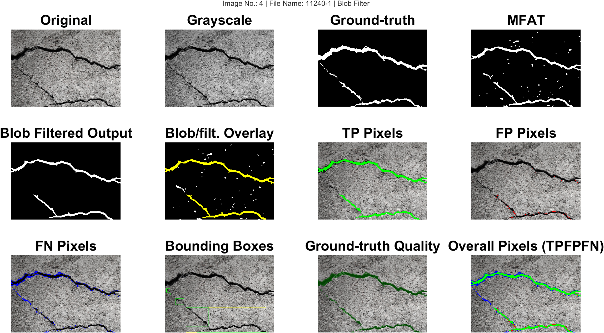

# Introduction
 

Cracks are the defects formed by cyclic loading, fatigue, shrinkage, creep, and so on. In addition, they represent the deterioration of the structures over some time. Therefore, it is essential to detect and classify them according to the condition grade at the early stages to prevent the collapse of structures. Cracks can be segmented using the classical semantic segmentation methods such as morphological, Hessian and Multiscale Fractional Anisotropic Tensor that are widely used in medical imaging community and deep learning approaches. In this repository, the object detection and semantic segmentation metrics for the binary class of the cracks and non-cracks are developed from scratch and presented.

# Quick Pipeline Visualization
## Example: Segmentation and object detection metrics
| Images after the segmentation and metrics |
| ------------- |
|  |

# Data samples
Sample images are used from the article:  
[1]. Liu, Yahui, Jian Yao, Xiaohu Lu, Renping Xie, and Li Li. "DeepCrack: A deep hierarchical feature learning architecture for crack segmentation." Neurocomputing 338 (2019): 139-153.

# Requirements
MATLAB  
Image Processing Toolbox

# Feedback
Please rate and provide feedback for the further improvements.
